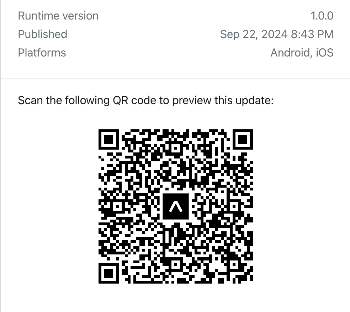

# Contact Manager App 📱

A mobile application built with **React Native** and **TypeScript**. This app allows users to manage their contacts easily with features like syncing mobile contacts, adding contacts manually, uploading profile photos, and clearing all contacts.

[Run the App with Expo go](https://expo.dev/preview/update?message=feat%3A%20Refactor%20gitlab%20workflow%20file%20and%20eas.json%0Aadds%20eas%20auto%20update%20for%20staging%20and%20prod%20env%0Aadds%20production.yml%20workflow&updateRuntimeVersion=1.0.0&createdAt=2024-09-22T09%3A59%3A33.618Z&slug=exp&projectId=45817b8c-8c28-4c71-a832-01b76ab9b113&group=3cb4bc31-57b1-4bb5-9437-85d827e24f59)

## App Features:
- **Sync Contacts**: Sync your phone's contacts and manage them within the app.
- **Add Contacts Manually**: Easily add new contacts by entering their details.
- **Edit Contacts**: Update contact information and upload profile images.
- **Delete Contacts**: Remove individual contacts or clear the entire contact list.
- **Profile Picture Upload**: Add and update contact profile pictures.
  
## How to Set Up and Run the Project

### 1. Clone the Project
To get started with the project locally, clone the repository:

git clone `git@github.com:chokonaira/contact-manager.git`
cd `contact-manager`

### 2. Install Dependencies
Make sure you have \`npm\` installed. Then, run the following command to install all necessary dependencies:

`npm install`

### 4. Run Test suites

`npm test`

### 3. Start the Development Server

- **For iOS**:
  If you're running on macOS, you can start the iOS simulator:

  `npx expo start --ios`

- **For Android**:
  Start the Android emulator or connect an Android device:

  `npx expo start --android`

- **Expo Go (For quick preview)**:
  Download **Expo Go** from the App Store or Play Store, then run the development server and scan the QR code:

  `npx expo start`

## Running the Already Published App

You can also run the already published build using **Expo Go** by simply downloading the Expo Go app and clicking the link below:
---

### Project Details:
- **Framework**: React Native
- **Language**: TypeScript
- **Jest**: Testing package
- **Expo**: For development and building

---

